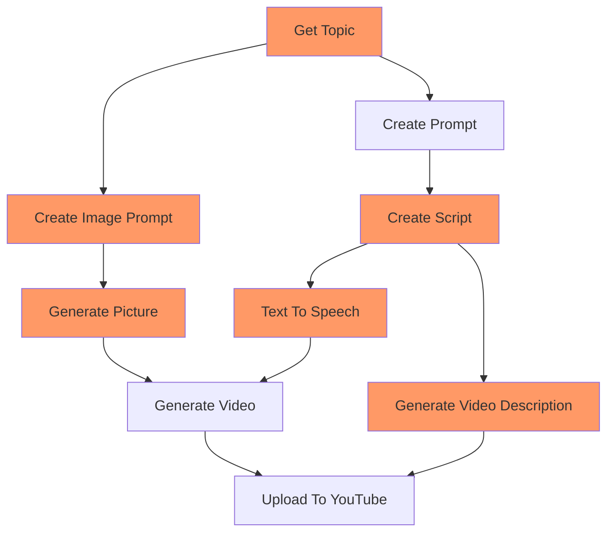

# Daily AI Meditations
This application is capable of generating self-guided meditation videos and uploading them to YouTube.

It's currently feeding [this YouTube Playlist][1]

_Use at your own risk, it can get expensive fast!_

[1]: https://www.youtube.com/playlist?list=PLy5ORBQVkCnCmWnWzQXKiAwZ2Tv0dO9iV
